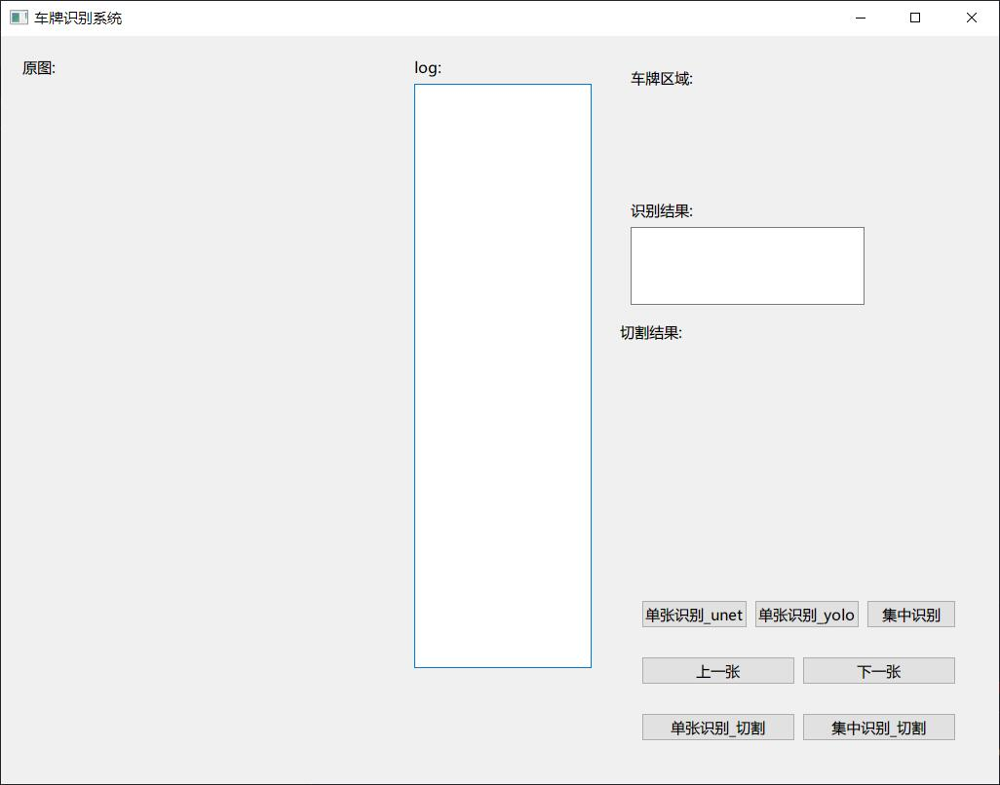
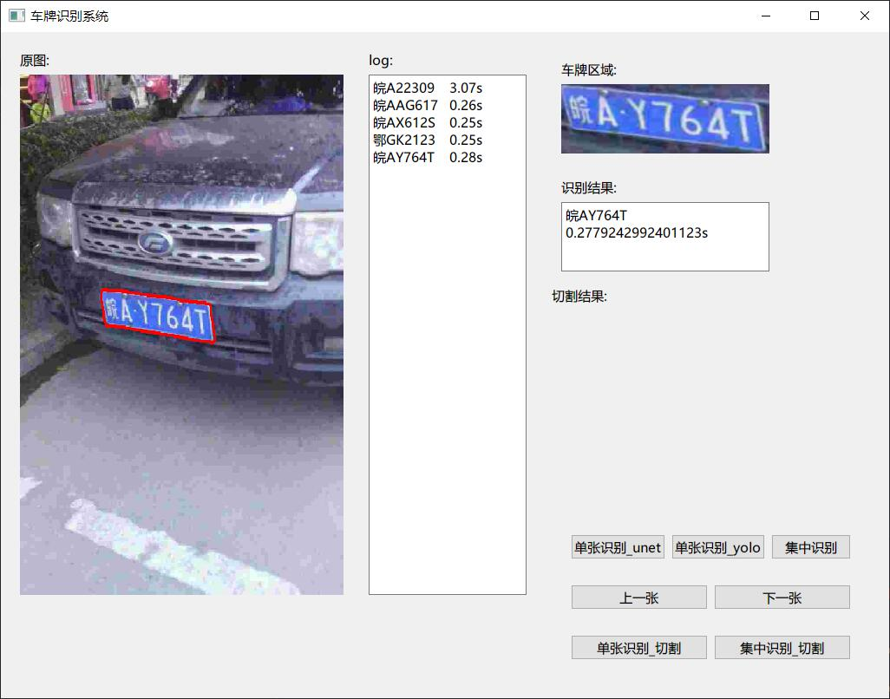
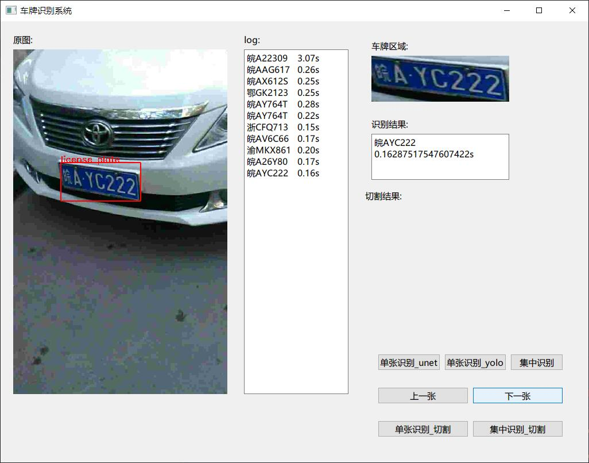
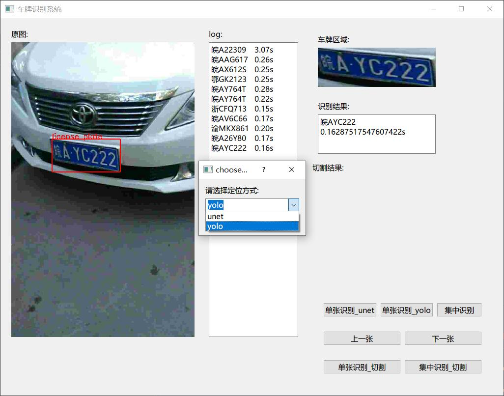
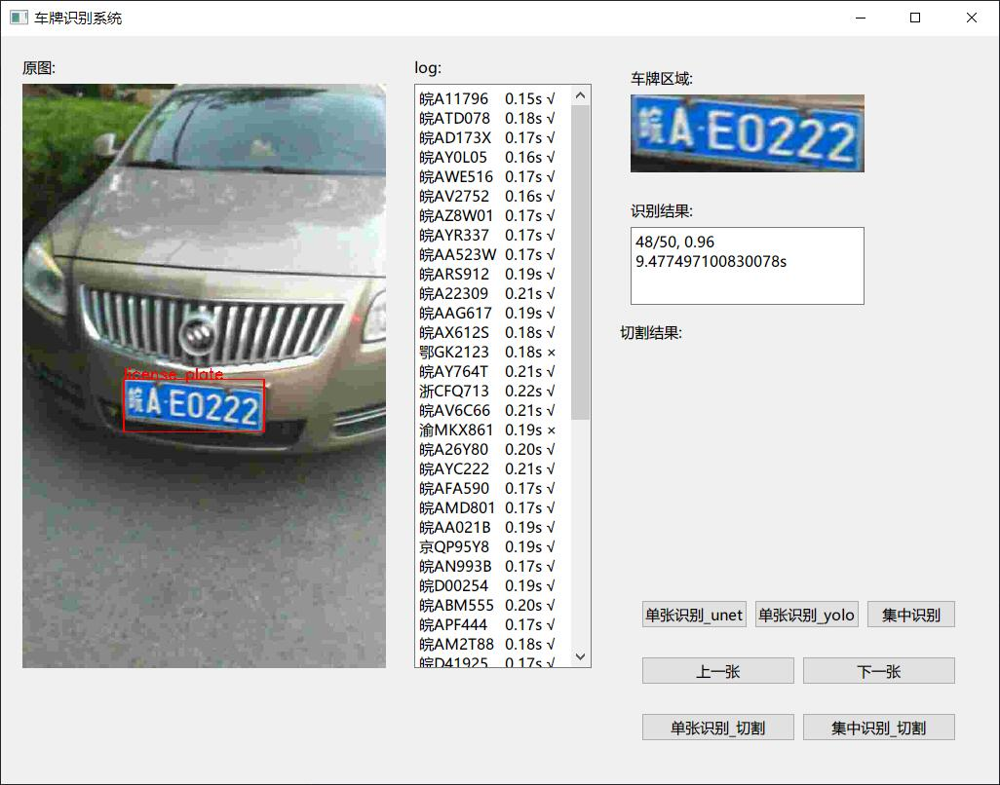

# 针对CCPD的车牌定位+识别

### 是一个也许能帮你通过课程设计（至少帮我通过了:laughing:）的一个小demo

## 包含内容⭐

* [X] U-Net车牌定位
* [X] YOLOv5车牌定位
* [X] 车牌分割
* [X] 单个字符识别
* [X] 端到端车牌识别
* [X] 可操作的互动型界面和集中识别

1.针对CCPD-BASE大概做到了95%+的识别率(其它没有测~)

2.集中测试可以选择文件夹进行批量识别并显示准确率

3.因为当时时间挺充裕的就做了多种方法，只是分割再识别的准确率有点惨

4.这个项目是由两个人完成的，但是后续维护应该只是我一个人，我完成的部分是U-Net / YOLO / 端到端识别和大部分的GUI。也就是说后续如果有这些部分之外的问题大概率是不会得到什么解答的（

5.有空会补充非常完整的项目复盘（更新在我自己的网站上），跟着复盘一步步来我感觉应该有手就能做出来（咕咕咕）

6.由于个人水平限制（太菜了），可能有很多地方写得很烂，轻喷~

## 界面展示⭐

## 准备工作

U-Net和识别部分使用tensorflow + keras

YOLO使用pytorch（大杂烩了属于是）

GUI使用PyQt5

需要它跑起来你可能还需要numpy / opencv2等（建议使用Anaconda）

开发环境使用Python 3.8.5
